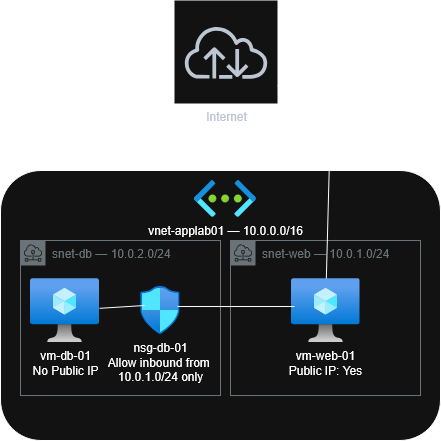

# Lab 02: Building a Secure 2-Tier Web Application with Terraform

**Author:** Bryce Johnson
**Estimated Time:** 45 Minutes
**Difficulty:** Beginner

---

## Objective

In this lab, you will use Terraform to provision an IaaS-based 2-tier application in Azure. You will create a Virtual Network with two subnets — a Public subnet for a Web Server and a Private subnet for a Database Server. You will configure a Network Security Group (NSG) to ensure the Database Server is protected from the internet and can only be accessed by the Web Server.

---

## Architecture Diagram



---

## Prerequisites

- [ ] Active Azure Subscription
- [ ] Azure CLI installed — verify with `az --version`
- [ ] Terraform installed — verify with `terraform --version`
- [ ] PowerShell terminal
- [ ] VSCode or preferred code editor

---

## Project Structure

```
applab01/
├── principles.tf    ← Terraform and provider configuration
├── variables.tf     ← Input variables (name, location, SSH key)
└── main.tf          ← All Azure resources
```

---

## Step-by-Step Instructions

#### Step 1: Log into Azure

```powershell
az login
```

A browser window will open. Sign into your Azure account. Once complete, verify your subscription:

```powershell
az account show
```

Copy the `id` field — this is your **Subscription ID**. You will need it in the next step.

---

#### Step 2: Generate an SSH Key Pair

In the Terminal, create the `.ssh` folder if it does not exist:

```powershell
mkdir C:\Users\<YourUsername>\.ssh
```

Generate your key pair:

```powershell
ssh-keygen -t rsa -b 4096 -f "C:\Users\<YourUsername>\.ssh\key-lab02"
```

Press **Enter** twice to skip the passphrase.

Print your public key and copy the output:

```powershell
cat "C:\Users\<YourUsername>\.ssh\key-lab02.pub"
```

The output will look like: `ssh-rsa AAAAB3Nz... username@computer`

---

### Phase 1: Create Your Terraform Files

#### `principles.tf`

```hcl
terraform {
  required_providers {
    azurerm = {
      source  = "hashicorp/azurerm"
      version = "~> 4.0"
    }
  }
}

provider "azurerm" {
  features {}
  subscription_id = "your-subscription-id-here"
}
```

> Replace `your-subscription-id-here` with the `id` value from `az account show`.

---

#### `variables.tf`

```hcl
variable "your_name" {
  description = "Your name, used in the resource group name"
  type        = string
  default     = "YOUR NAME"
}

variable "location" {
  description = "Azure region to deploy into"
  type        = string
  default     = "SELECT_REGION"
}

variable "admin_ssh_key" {
  description = "Your public SSH key for VM access"
  type        = string
  default     = "PASTE YOUR PUBLIC KEY HERE"
}
```

> Replace `PASTE YOUR PUBLIC KEY HERE` with the full output from `cat key-lab02.pub`.

---

#### `main.tf`

```hcl
# ── Phase 1: Network Foundation ──────────────────────────

resource "azurerm_resource_group" "applab01" {
  name     = "rg-applab01-${var.your_name}"
  location = var.location
}

resource "azurerm_virtual_network" "applab01" {
  name                = "vnet-applab01"
  location            = azurerm_resource_group.applab01.location
  resource_group_name = azurerm_resource_group.applab01.name
  address_space       = ["10.0.0.0/16"]
}

resource "azurerm_subnet" "web" {
  name                 = "snet-web"
  resource_group_name  = azurerm_resource_group.applab01.name
  virtual_network_name = azurerm_virtual_network.applab01.name
  address_prefixes     = ["10.0.1.0/24"]
}

resource "azurerm_subnet" "db" {
  name                 = "snet-db"
  resource_group_name  = azurerm_resource_group.applab01.name
  virtual_network_name = azurerm_virtual_network.applab01.name
  address_prefixes     = ["10.0.2.0/24"]
}

# ── Phase 2: Web Server ───────────────────────────────────

resource "azurerm_public_ip" "web" {
  name                = "pip-web-01"
  location            = azurerm_resource_group.applab01.location
  resource_group_name = azurerm_resource_group.applab01.name
  allocation_method   = "Static"
  sku                 = "Standard"
}

resource "azurerm_network_interface" "web" {
  name                = "nic-web-01"
  location            = azurerm_resource_group.applab01.location
  resource_group_name = azurerm_resource_group.applab01.name

  ip_configuration {
    name                          = "internal"
    subnet_id                     = azurerm_subnet.web.id
    private_ip_address_allocation = "Dynamic"
    public_ip_address_id          = azurerm_public_ip.web.id
  }
}

# You might need to locate a different size depending on the region you select.
# I often use Standard_D2s_v3 as an alternative.
resource "azurerm_linux_virtual_machine" "web" {
  name                  = "vm-web-01"
  location              = azurerm_resource_group.applab01.location
  resource_group_name   = azurerm_resource_group.applab01.name
  size                  = "Standard_B1s"
  admin_username        = "azureuser"
  network_interface_ids = [azurerm_network_interface.web.id]

  admin_ssh_key {
    username   = "azureuser"
    public_key = var.admin_ssh_key
  }

  os_disk {
    caching              = "ReadWrite"
    storage_account_type = "Standard_LRS"
  }

  source_image_reference {
    publisher = "Canonical"
    offer     = "0001-com-ubuntu-server-focal"
    sku       = "20_04-lts"
    version   = "latest"
  }
}

# ── Phase 3: Database Server ──────────────────────────────

resource "azurerm_network_interface" "db" {
  name                = "nic-db-01"
  location            = azurerm_resource_group.applab01.location
  resource_group_name = azurerm_resource_group.applab01.name

  ip_configuration {
    name                          = "internal"
    subnet_id                     = azurerm_subnet.db.id
    private_ip_address_allocation = "Dynamic"
  }
}

# You might need to locate a different size depending on the region you select.
# I often use Standard_D2s_v3 as an alternative.
resource "azurerm_linux_virtual_machine" "db" {
  name                  = "vm-db-01"
  location              = azurerm_resource_group.applab01.location
  resource_group_name   = azurerm_resource_group.applab01.name
  size                  = "Standard_B1s"
  admin_username        = "azureuser"
  network_interface_ids = [azurerm_network_interface.db.id]

  admin_ssh_key {
    username   = "azureuser"
    public_key = var.admin_ssh_key
  }

  os_disk {
    caching              = "ReadWrite"
    storage_account_type = "Standard_LRS"
  }

  source_image_reference {
    publisher = "Canonical"
    offer     = "0001-com-ubuntu-server-focal"
    sku       = "20_04-lts"
    version   = "latest"
  }
}

# ── Phase 5: Network Security Group ──────────────────────

resource "azurerm_network_security_group" "db" {
  name                = "nsg-db-01"
  location            = azurerm_resource_group.applab01.location
  resource_group_name = azurerm_resource_group.applab01.name

  security_rule {
    name                       = "Allow-Web-Subnet"
    priority                   = 100
    direction                  = "Inbound"
    access                     = "Allow"
    protocol                   = "*"
    source_port_range          = "*"
    destination_port_range     = "*"
    source_address_prefix      = "10.0.1.0/24"
    destination_address_prefix = "*"
  }
}

resource "azurerm_subnet_network_security_group_association" "db" {
  subnet_id                 = azurerm_subnet.db.id
  network_security_group_id = azurerm_network_security_group.db.id
}
```

---

### Phase 2: Deploy the Infrastructure

Run the following commands in PowerShell from inside your `applab01` folder:

**Initialize Terraform** (downloads the Azure provider):
```powershell
terraform init
```

**Preview the deployment** (nothing is built yet):
```powershell
terraform plan
```

You should see `Plan: 10 to add, 0 to change, 0 to destroy.`

**Deploy everything:**
```powershell
terraform apply
```

Type `yes` when prompted. Deployment takes 2–5 minutes.

---

### Phase 3: Validate in the Azure Portal

After `terraform apply` completes, go to the Azure Portal and verify each item below.

#### Resource Group exists

- [ ] Resource group `rg-applab01-NAME` exists in your selected region

> **Screenshot placeholder** — take a screenshot of the resource group overview page and drop it here.
> ``

---

#### VNet and Subnets

- [ ] `vnet-applab01` contains both `snet-web` and `snet-db` subnets

> **Screenshot placeholder** — take a screenshot of the Subnets tab inside `vnet-applab01`.
> ``

---

#### Web Server has a Public IP

- [ ] `vm-web-01` has a Public IP address assigned on the overview page

> **Screenshot placeholder** — take a screenshot of the `vm-web-01` overview page showing the Public IP.
> ``

---

#### Database Server has NO Public IP

- [ ] `vm-db-01` shows **no** Public IP address on the overview page

> **Screenshot placeholder** — take a screenshot of the `vm-db-01` overview page confirming no Public IP.
> ``

---

#### NSG is configured correctly

- [ ] `nsg-db-01` is associated with `snet-db` with the `Allow-Web-Subnet` inbound rule

> **Screenshot placeholder** — take a screenshot of the NSG inbound rules.
> ``

---

## Troubleshooting

| Issue | Fix |
|---|---|
| `subscription ID could not be determined` | Add `subscription_id` to the provider block in `principles.tf` |
| `SkuNotAvailable` for VM size | Run `az vm list-skus --location <region> --resource-type virtualMachines --output table` to find an available size, or try a different region |
| `InvalidResourceReference` on NIC | Run `terraform apply` again — this is a timing issue where the NIC tried to create before the subnet finished |
| Duplicate resource error | Search for duplicate resource blocks in `main.tf` and remove the extra copy |
| SSH key path not found | Use the full Windows path: `C:\Users\<YourUsername>\.ssh\key-lab02` |
| Error: creating Linux Virtual Machine - Standard_B1s' is currently not available in location 'REGION'. Please try another size or deploy to a different location or different zone. | You may need to locate a differnt VM size. "Standard_D2s_v3" often has availability. |

---

## VM Management (Cost Control)

To avoid using Azure credits overnight, **deallocate** your VMs instead of destroying everything:

```powershell
az vm deallocate --resource-group rg-applab01-YOUR_NAME --name vm-web-01
az vm deallocate --resource-group rg-applab01-YOUR_NAME --name vm-db-01
```

To start them again before your next lab:

```powershell
az vm start --resource-group rg-applab01-YOUR_NAME --name vm-web-01
az vm start --resource-group rg-applab01-YOUR_NAME --name vm-db-01
```

---

## Clean Up

When you are completely done with this lab, destroy all resources:

```powershell
terraform destroy
```

Type `yes` when prompted. This deletes everything inside `rg-applab01-YOUR_NAME`.

---

## Key Concepts Learned

| Concept | What It Means |
|---|---|
| `variables.tf` | Stores input values — the "ingredients list" |
| `main.tf` | Builds the actual resources — the "recipe" |
| `terraform plan` | Previews changes without touching Azure |
| `terraform apply` | Deploys the infrastructure |
| `terraform destroy` | Tears down all resources |
| NIC | The bridge between a VM and its subnet/public IP |
| NSG | A firewall — controls what traffic is allowed in or out |
| No Public IP on DB VM | The DB server is unreachable from the internet by design |
